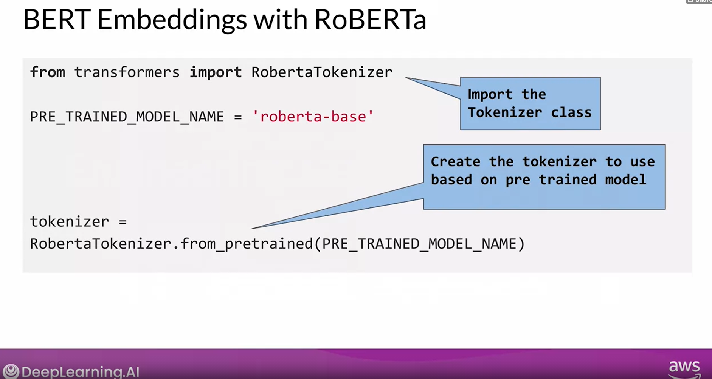

[Notebook link BERT](https://github.com/AIsquare/BERT-on-AWS/blob/main/BERT%20feature%20engineering%20at%20scale.ipynb) 
# RoBERTa

Built on top of BERT model but it modifies the hyperparameter and the way model is trained. It also uses a lot more training data than BERT model.


Import the class and then create an object of tokenizer to construct the tokenizer class, then you specify the pretrained model. The pretrained model used here is **'roberta-base'**.
> Next is to run the encode plus method.


* The 'review' parmeter is the raw review text from the dataset, which is  to be encoded.
* The maximum sequence length i.e 128, it is the maximum number of tokens that can be passed into BERT with a single sample. Why 128 well it came into analysis to perform well with this.

The real challenge comes when you have to generate embeddings at scale. The challenge is generating feature engineering at scale. To address this challenge nothing comes handy but **Amazon SageMaker Processing** it provides pre processing, post processing and model evaluation at scale. It uses distribute clusters. SageMaker processing job executes on the conifgure clusters. It comes with built in sklearn library.
> just specify the raw data in S3 bucket SageMaker processing will execute the Sklearn script on the raw data.


### These parameters include a script to execute. This is a python script that consists of the SKLearn code to generate the embeddings. You provide the processing input that specifies the location of the input data in the S3 Bucket. 

<br>
<br>
<br>


## And you specify where in S3 the output should go to and you mention it using the processing output construct.


# Feature Store

A lot of effort goes into feature engineering. It would save you a lot of time, if you can store the results of feature engineering efforts, and reuse those results so that you don't have to run the future engineering pipeline again and again. It would save time not only for you, but for any other teams in your organization, that may want to use the same data and same features, for their own machine learning projects. 
**Amazon SageMaker Feature Store** is a purpose-built repository where you can store and access features so it’s much easier to name, organize, and reuse them across teams. SageMaker Feature Store provides a unified store for features during training and real-time inference without the need to write additional code or create manual processes to keep features consistent. SageMaker Feature Store keeps track of the metadata of stored features (e.g. feature name or version number) so that you can query the features for the right attributes in batches or in real time using Amazon Athena, an interactive query service. SageMaker Feature Store also keeps features updated, because as new data is generated during inference, the single repository is updated so new features are always available for models to use during training and inference.


SageMaker provides you with centralised repository to effciently serve you in any machine learning project. A typical challenge that data scientist faces is **training and inference skew** that could result from discrepancies in the data used for training and the data used for intrinsic. Sagemaker Feature Store helps reduce the skew by reusing the features across training and inference traces and by keeping the features consistent. SageMaker Feature Store creates features both in real-time and batch


<br>
<br>
<br>
Once the feature group is created, it's time to ingest features into the feature group. Here, you use the ingest API that will be used to ingest features into the feature group in a multi-threaded fashion. Once the features group is populated, you can retrieve the features by taking advantage of the retrieved APIs. Here, you are seeing one possible way to retrieve the features. The features are directly from the S3 location where the features are persister, you take advantage of the athena query object.


Once you have the query string, you run the run method on the Athena query object by passing in the query string. This results the queried features in a DataFrame format. Now, you have an option to convert that DataFrame into a CSV file and save the CSV file wherever you need to. In fact, you can store the CSV file into an S3 location and use that as a direct input to a training job on SageMaker.


```python

```
